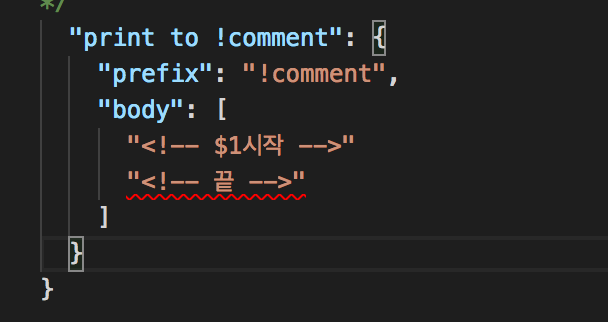
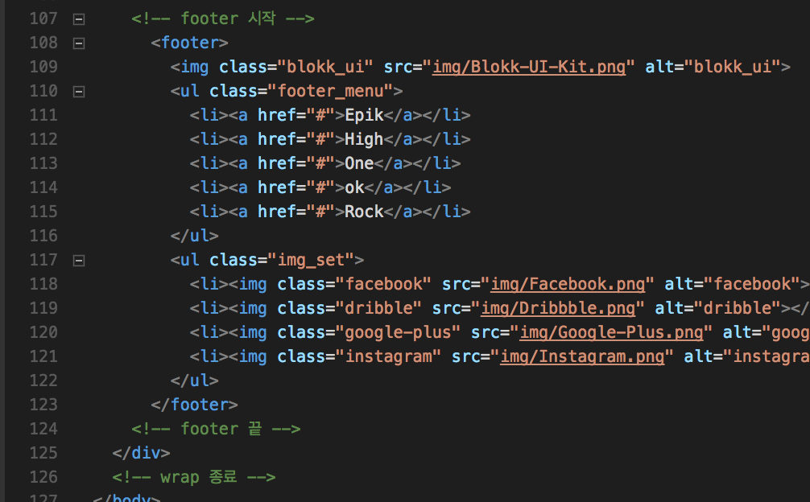
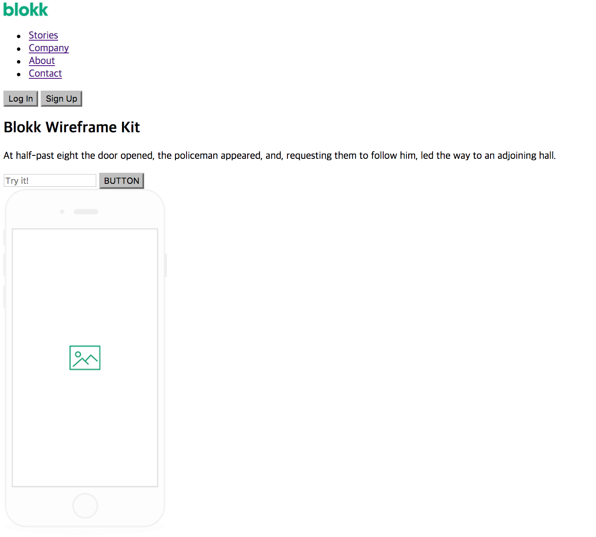
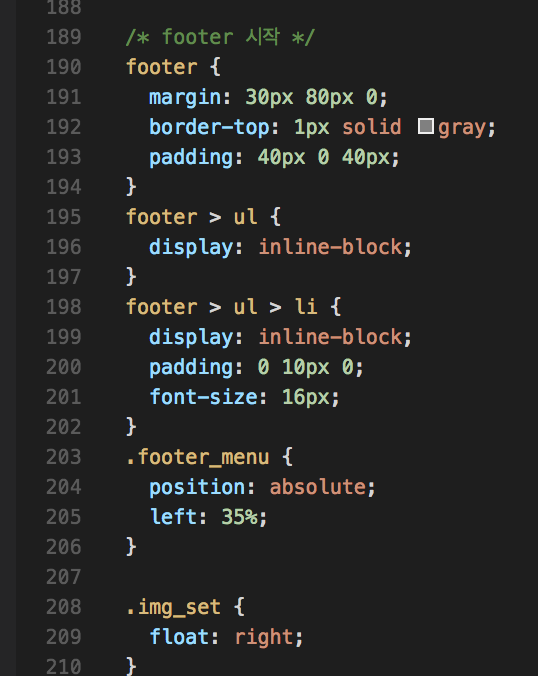

## snippet

스니펫을 처음으로 써보았다.  
이걸 이용하면 코드 조각을 미리 만들어 놓을 수 있다.  
포인터를 지정해줄 수 있다.  
더 나아가 탭 인덱스도 줄 수 있다.  

일단 주석을 만드는 용도로 썼다.  
주석을 쉽게 만드는 것만으로도 충분히 감동적이었다.  

---

## 페이지 만들기

### html
html은 css에 비해 코드 라인이 적다.  
그렇다고 쉽지만은 않았다.  
클래스 설정이 은근 어려웠다.  
클래스가 요소를 잘 표현하는 게 관건인 거 같다.

>뼈만 있는 페이지

### css
css는 생각 이상으로 어려웠다.  
머릿 속에 있는 다소 흐릿한 형상.  
그걸 선명히 만드는 과정.  
그곳에 칼같은 수치가 관여하니까 시간이 많이 소요된다.

어찌저찌 외형은 비슷하게 만들었다.  
하지만 코드를 다시 보니 너무 비효율적인 부분이 많았다.  

>살도 있는 페이지

---

### 마치며

마크업을 잘하려면 프로그래밍을 잘해야한다.  
