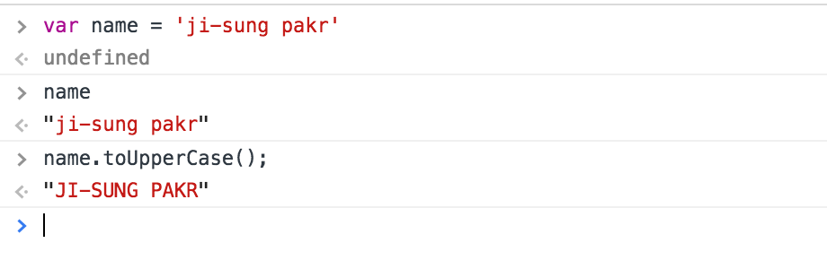
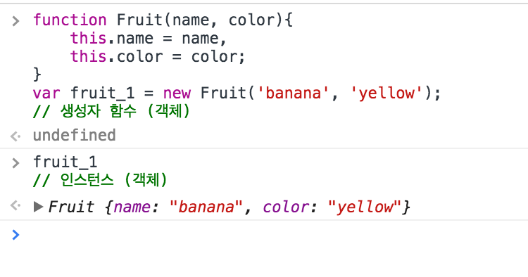

## Wrapper Class

보통 Primitive data type은 property가 없다.  
그러나 자바스크립트에서는 property(method)를 사용할 수 있다.  

이것이 가능한 것은 wrapper class 덕분이다.  
메소드 호출 시에 자바스크립트는 wrapper class로 대상을 감싼다.  
이후 wrapper class를 해제한다.  

## Instance

Instance란 무엇인가?
이것을 설명하기 위해서는 먼저 객체를 알아야 한다.  
객체는 데이터 타입의 일종인데, function(함수)은 그중 하나이다.  
한편 함수는 객체이면서 객체를 만들 수 있다.  
이런 함수를 생성자 함수라고 한다.

객체로 만들어진 객체.  
유상무상무상과도 같은 꼬리물기가 이어지는 상황.  
이러한 상황을 타파하는 개념이 바로 '인스턴스'이다.  
생성자 함수로 만들어진 객체 또한 객체이다.  
하지만 인스턴스라 일컫는 것이 의미 전달에 있어서 명확하다.
